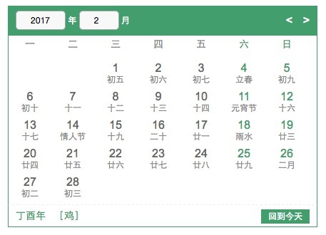

# calendar
js日历控件
基于百度日历进行改造

# 用法
### html
        

            

                

                    <select id="year-select"></select>&nbsp;年
                    <select id="month-select"></select>&nbsp;月
                

                

                    <
                    >                               
                

            

            <ul id="wk">
                <li>一</li>
                <li>二</li>
                <li>三</li>
                <li>四</li>
                <li>五</li>
                <li><b>六</b></li>
                <li><b>日</b></li>
            </ul>
            

            

                

                    年 &nbsp;
                    ［］
                

                <a href="javascript:;;" id="now-date">回到今天</a>
            

        

### js

		calendar.init({
		    cellClickCallback: function(cell, datedata){
		        console.log(datedata);
		        alert('你点击的是'+ datedata.solarYear + '年' + datedata.solarMonth + '月' + datedata.solarDate + '日');        
		    }
		});

### datedata

	solarYear 年
	solarMonth 月
	solarDate 日
	lunarMonthInChinese 农历月份
	lunarDateInChinese 农历日
	ganzhiYear 天干地支 年
	ganzhiMonth 天干地支 月
	ganzhiDate 天干地支 日
	lunarFestival 节日
	jieqi 节气

### 参数
    * cellClickCallback: 日期点击回调callback
    * yearSelectId: 年份select下拉选择框
    * monthSelectId: 月份select下拉选择框
    * heavenlyId: 天干
    * branchId: 地支
    * prevId: 月份向前step
    * nextId: 月份向后step
    * nowDateId: 返回今天日期按钮,
    * isSelect: 是否显示年月下拉框,
    * isHeavenlyBranch: 是否显示天干地支,
    * isShowFd: 是否显示鼠标hover对应日期详细信息

