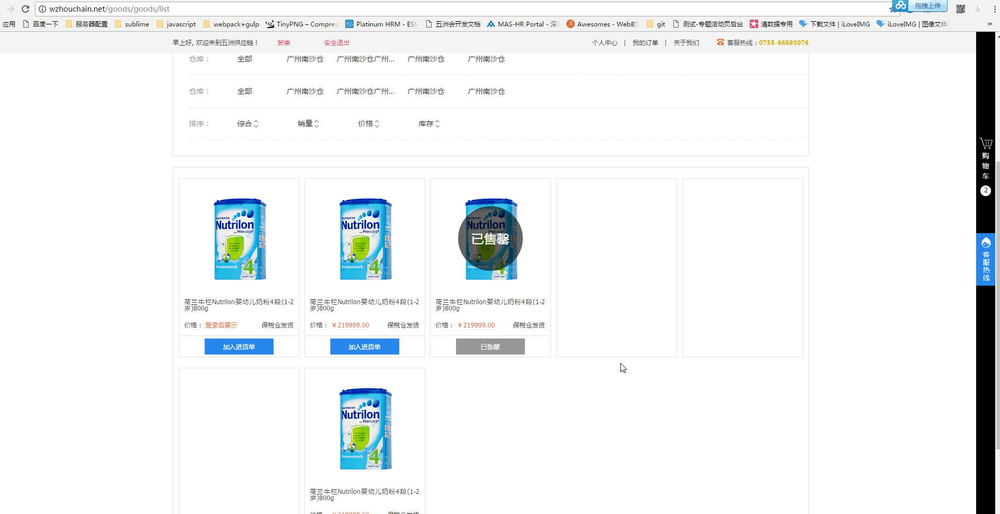

###使用如下：
```javascript
	/**
     * js抛物线动画
     * @param  {[object]} origin [起点元素]
     * @param  {[object]} target [目标点元素]
     * @param  {[object]} element [要运动的元素]
     * @param  {[number]} a [抛物线弧度]
     * @param  {[number]} time [动画执行时间]
     * @param  {[function]} callback [抛物线执行完成后回调]
     */
	new parabola({
		origin: $origin,
		target: $target,
		element: $item,
		callback: function(el){
			el.remove();
		}
	}).move()
```